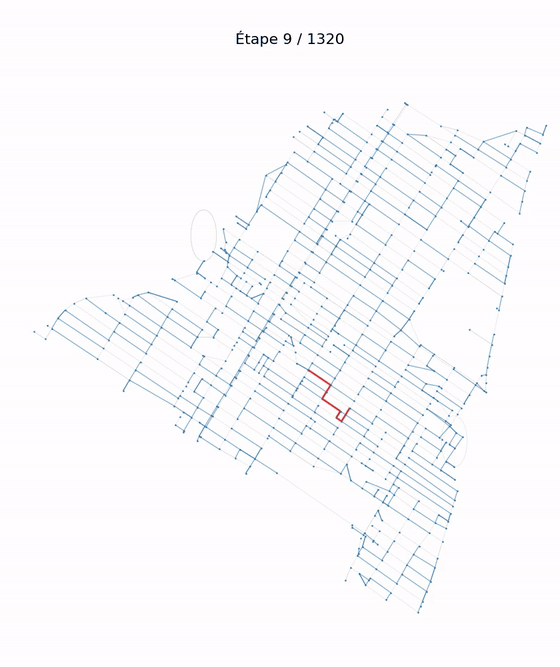
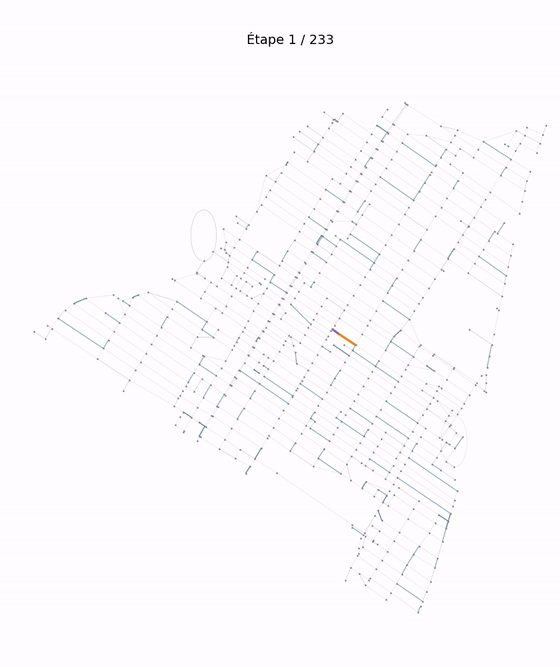
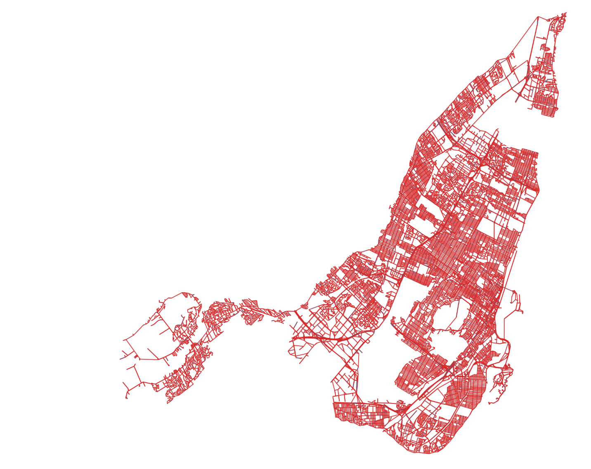

# ERO1: snow removal in Montreal

Operations research project done at EPITA (group 25).

Snow removal is expensive in Montreal. The goal of the project is to plan
routes for:

- a **drone** that flies over every street of the city to measure snow;
- **snowplows** that only clear the snowy streets, following one-way rules.

Several scenarios are then compared on distance, cost and time.

<p align="center">
  
  
</p>
<p align="center">
  <em>Left: the drone. Right: 4 snowplows. Both on Plateau-Mont-Royal (videos sped up x2 and x4).</em>
</p>

The research notebooks and the report (`ERO1.pdf`) are in French.

## Data

Road networks come from OpenStreetMap through `osmnx` and are handled as
`networkx` graphs weighted by street length.

- For the drone, Montreal is an **undirected**, connected multigraph: the
  drone follows the streets but ignores one-way rules.
- For the snowplows, a neighborhood is a **directed** multigraph which is not
  necessarily strongly connected (we learned that the hard way, see below).

Graphs are downloaded once and saved with `pickle` in `database/`, so runs
don't depend on the network.

<p align="center">
  
</p>

## Approach

### Drone: Chinese postman problem

The drone has to go through every street at least once while flying as little
as possible, which is the Chinese postman problem.

1. We first wrote everything by hand (Dijkstra, matching of odd degree
   vertices, eulerian circuit) and tested it on random adjacency matrices
   (`drone/Drones_Naif.ipynb`). It worked, but not past 17 nodes.
2. Switching to `networkx` got us to several hundred nodes
   (`drone/Drones_Graphe_Aleatoire.ipynb`).
3. Animating the route with `matplotlib` showed that `nx.eulerize` ignores
   edge weights. We went back to our own version: a minimum weight matching
   between odd vertices (`max_weight_matching` on negated distances), then
   the matching shortest paths are duplicated. The distance flown ends up very
   close to the total length of the streets.
4. Scaling up to real neighborhoods (`drone/Drones_Montreal.ipynb`), with the
   eulerized graphs saved in `database/eulerized_maps/`.
5. On the whole city, matching every odd vertex takes too long. Odd vertices
   are grouped into clusters (KMeans on their coordinates), matched inside
   each cluster, and the leftovers are matched globally
   (`drone/Drones_Automatisation_Cluster.ipynb`). More clusters is faster but
   gives a worse circuit; we kept `k = 130`.

### Snowplows: Floyd-Warshall and a greedy route

Once the snowy streets are known, they all have to be cleared without
breaking traffic rules.

1. First, a simple version: the snowplow starts somewhere, drives to the
   nearest snowy street, clears it, and repeats. Distances between every pair
   of nodes come from Floyd-Warshall (`deneigeuses/Deneigeuse.ipynb`).
2. Floyd-Warshall takes most of the run time but does not depend on the
   snow, so it is computed once per neighborhood and stored in
   `database/floyd_warshall_data/`.
3. On real neighborhoods, some one-way streets lead into dead ends: a
   snowplow that goes in can never get out. The graph is not strongly
   connected after all. Instead of computing strongly connected components,
   we filter with a reachability heuristic: a street that too many nodes
   cannot reach is ignored, and we avoid streets from which less than half of
   the remaining targets are reachable.
4. To use several snowplows, the work is split before running the greedy
   route: we pick 4 far apart points (west, east, south and north of the
   neighborhood) and each snowy street goes to the closest one according to
   Floyd-Warshall. Every snowplow leaves from the center of the neighborhood.

### Scenarios

`ero1.py` randomly covers a neighborhood in snow (30% of the streets by
default) and compares three scenarios:

- **fastest**: 4 type II snowplows;
- **fewest vehicles**: a single snowplow, type I or II;
- **cheapest**: the cheapest of the simulated setups.

| | Speed | Fixed cost / day | Cost per km | Hourly cost (first 8 h / after) |
|---|---|---|---|---|
| Drone | | 100 € | 0.01 € | |
| Type I | 10 km/h | 500 € | 1.1 € | 1.1 € / 1.3 € |
| Type II | 20 km/h | 800 € | 1.3 € | 1.3 € / 1.5 € |

Example on Outremont:

```
Total road length: 71.3 km

== Drone ==
Distance: 53.77 km
Cost: 100.54 €

== Fastest: 4 type II snowplows ==
Total distance: 49.85 km
Total cost: 3268.05 €
Time: 0 h 50 min

== Fewest vehicles: 1 snowplow ==
Total distance: 48.07 km
Total cost: 558.17 € with type I, 865.62 € with type II
Time: 4 h 48 min with type I, 2 h 24 min with type II

== Cheapest ==
1 type I snowplow
Total cost: 558.17 €
Time: 4 h 48 min
Total distance: 48.07 km
```

### Limits

- Snowplow routes make sense but are not optimal: the greedy approach never
  revisits its choices, and the 4 snowplows don't coordinate.
- Bad edge detection is still a heuristic. Working on the main strongly
  connected component would be cleaner.
- The drone has no speed or battery limit, and it follows the streets
  instead of flying over buildings.

## Repository layout

```
ERO1.ipynb          summary notebook: simulation and animations
ERO1.html / .pdf    notebook export and report
ero1.py             command line scenario comparison
animations/         videos generated by the notebooks
database/
  maps/             neighborhood and city graphs (osmnx)
  eulerized_maps/   eulerized versions for the drone
  floyd_warshall_data/  Floyd-Warshall results (Git LFS)
  get_and_save.py   downloads a neighborhood
  load.py           prints a few stats about a graph
deneigeuses/        snowplow research notebooks
drone/              drone research notebooks, in order:
                    Naif, Graphe_Aleatoire, Montreal, Automatisation, Cluster
```

## Running it

Floyd-Warshall results are stored with Git LFS:

```bash
git lfs pull
```

```bash
./install.sh
```

Compare scenarios on a neighborhood:

```bash
python3 ero1.py
```

Animations: open `ERO1.ipynb` with `jupyter lab` and run all cells (change
the `quartier` variable to pick another neighborhood).

## Authors

Arthur Pauchey, Elie Dalmas, Eric Hennebert, Quentin Lauret
